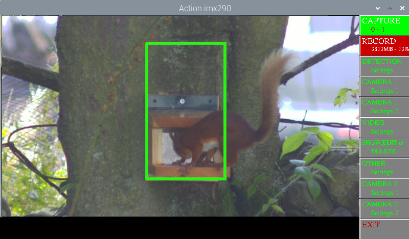

# Pi_Videoer2

A python script to capture Videos from Pi v1,2,3 , HQ or GS cameras , Arducam OWLSIGHT or HAWKEYE 64MP AF camera, Arducam 16MP AF camera or Waveshare imx290-83 camera, triggered by motion , external trigger or manually. 
Uses Raspberry OS BULLSEYE or BOOKWORM (for BOOKWORM switch to X11 not Wayland) and Picamera2.

for arducam cameras follow their installation instructions eg. https://docs.arducam.com/Raspberry-Pi-Camera/Native-camera/64MP-Hawkeye/

the waveshare imx290-83 can be switched connected to gpio26, pin 37.

It will capture videos at 25fps at 1920 x 1080, or on a GS camera 1456 x 1088.

lt also captures frames before the trigger frame, default is 2 seconds but user settable.

Pi v3, Arducam HAWKEYE, OWLSIGHT or 16MP cameras can be auto / manually focussed. Pi v3 also can do spot focus.

Makes individual mp4s, and can make a FULL MP4 of MP4s stored.

Can control focus on a pi v3camera, auto, continuous,  manual or spot. For spot click on image when in menu showing focus options.

mp4s captured in /home/《user》/Videos.

## Screenshot

To install:

Install latest FULL RaspiOS based on Bullseye or Bookworm (tested with FULL 32bit and 64bit versions)

if using BOOKWORM switch to X11. sudo raspi-config, choose advanced , choose 6A X11 option, reboot.

sudo apt install python3-opencv

Download PiVideoer2.py and copy to /home/《user》

Note buttons with RED text use right mouse click, others left click. Click on left or right part of button as appropriate.
